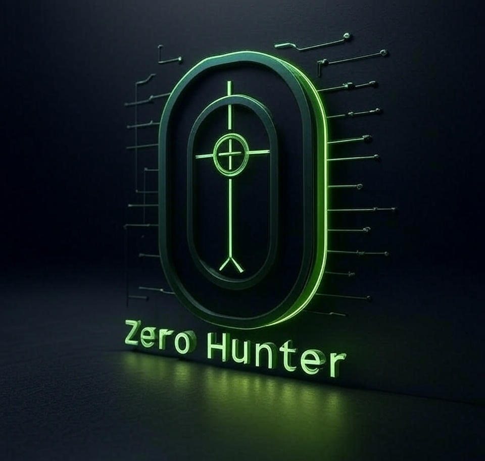

  

<h1 align="center">ZeroHunter</h1>

<strong>Advanced Offensive Security Toolkit</strong>

  Reconnaissance • Exploitation • Payloads • C2 • AI-powered Analysis

# ZeroHunter – Next-Generation Offensive Cybersecurity Platform

ZeroHunter is a cutting-edge, full-spectrum offensive cybersecurity platform engineered to empower security professionals with unparalleled control over every stage of a cyber attack. Designed for precision, scalability, and stealth, ZeroHunter integrates state-of-the-art modules for reconnaissance, exploitation, payload generation, and command & control (C2), all enhanced by advanced artificial intelligence to deliver actionable insights and automate complex decision-making processes.

## 🚀 Core Capabilities

- **Comprehensive Reconnaissance Engine:** Combines automated OSINT collection, Shodan API integration, and real-time network fingerprinting to map target infrastructures with surgical accuracy.
- **Multi-Vector Exploitation Framework:** Supports a broad range of exploits and zero-day integrations, allowing seamless deployment of tailored payloads across diverse environments and platforms.
- **Adaptive Payload Generation:** Dynamically crafts polymorphic and multi-stage payloads designed to evade modern defenses, incorporating Metasploit integration and custom scripting.
- **Robust Command & Control (C2) Infrastructure:** Establishes resilient, encrypted, and covert C2 channels for persistent, stealthy remote operations.
- **AI-Powered Threat Intelligence & Analysis:** Leverages machine learning models to analyze reconnaissance data, predict vulnerabilities, prioritize targets, and automate exploitation strategies — drastically reducing time-to-compromise.
- **Interactive, Intuitive CLI:** Features a rich terminal interface with real-time color-coded feedback, comprehensive logging, and multi-threaded task management to optimize operator efficiency.
- **Seamless Environment & API Management:** Enables effortless integration and secure management of environment variables and critical API keys (e.g., Shodan, Groq), facilitating rapid configuration and deployment.

## 🌐 Designed for Real-World Impact

ZeroHunter transcends traditional penetration testing tools by merging AI-driven automation with modular offensive capabilities, creating a platform capable of executing sophisticated cyber operations in highly dynamic environments. Built with extensibility and security in mind, it supports integration with third-party tools and adapts to emerging threats, positioning itself at the forefront of cybersecurity offense technology.

## 🔒 Project Status & Confidentiality

Currently in active development as a capstone academic project, ZeroHunter’s source code remains private to safeguard innovation and intellectual property. This repository serves as a detailed technical overview and engagement portal.

## 📞 Contact & Collaboration

For demonstrations, partnerships, or detailed technical discussions, please reach out via:

📧 amibeodhgl@gmail.com

---

*Note: Source code is proprietary and not publicly accessible at this time.
